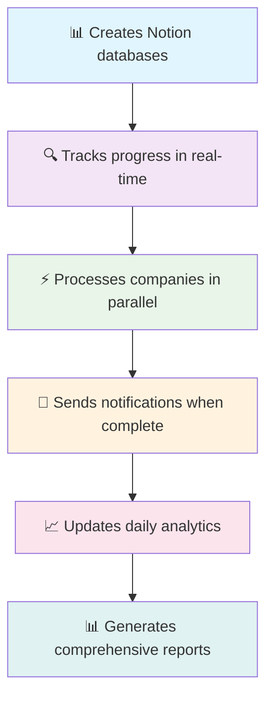

<div align="center">

# 🚀 Getting Started - One Command Setup
*The fastest way to start prospecting with AI automation*

🎯 **Complete setup in 2-3 minutes** • 🚀 **First campaign in 5 minutes** • 📊 **Results in Notion dashboard**

**Created by [Minhal Abdul Sami](https://www.linkedin.com/in/minhal-abdul-sami/)**

</div>

---

## 💆‍♂️ For Complete Beginners

<div align="center">

### 🎆 **Magic Command - Does Everything!**

</div>

```bash
python cli.py quick-start
```

<div align="center">

**🎉 This single command handles everything automatically:**

| Step | What Happens | Time |
|:---:|:---|:---:|
| ⚙️ | Validates your configuration | 10s |
| 📊 | Sets up your Notion dashboard | 30s |
| 🔍 | Finds and processes 5 companies | 2-3 min |
| 🧠 | Extracts prospects and contacts | Included |
| 📧 | Generates personalized emails | Included |
| 📊 | Updates analytics and notifications | 10s |

**🎆 Total Time: 3-4 minutes for complete automation!**

</div>

## 📈 For Regular Use

<div align="center">

### 💪 **Power User Command - Full Control**

</div>

```bash
python cli.py run-campaign --limit 10 --generate-emails --send-emails
```

<div align="center">

**🎯 Customizable Options:**

| Option | Purpose | Example |
|:---|:---|:---|
| `--limit 10` | Process 10 companies | More prospects |
| `--generate-emails` | Create personalized emails | Ready to review |
| `--send-emails` | Send emails immediately | Full automation |
| `--campaign-name "My Campaign"` | Custom campaign tracking | Organization |
| `--sender-profile profiles/my_profile.md` | Use specific profile | Personalization |

</div>

### 🚀 **Quick Commands Reference**

```bash
# Recommended for beginners
python cli.py quick-start

# Standard campaign (most common)
python cli.py run-campaign --limit 10 --generate-emails

# Full automation with sending
python cli.py run-campaign --limit 5 --generate-emails --send-emails

# Custom campaign with profile
python cli.py run-campaign --limit 10 --generate-emails --sender-profile profiles/my_profile.md --campaign-name "Weekly Outreach"
```

## ⚙️ Prerequisites & Setup

<div align="center">

### 📄 **Before You Start**

</div>

<div align="center">

| Requirement | Status | Action |
|:---|:---:|:---|
| **Python 3.13+** | ❓ | [Download here](https://www.python.org/downloads/) |
| **Dependencies** | ❓ | `pip install -r requirements.txt` |
| **API Keys** | ❓ | [Setup guide](docs/API_KEYS_GUIDE.md) |

</div>

### 🔑 **Required API Keys**

```env
# Essential for automation (add to .env file)
NOTION_TOKEN=your_notion_token
HUNTER_API_KEY=your_hunter_api_key
OPENAI_API_KEY=your_openai_api_key

# Optional for email sending
RESEND_API_KEY=your_resend_api_key
SENDER_EMAIL=your-name@yourdomain.com
SENDER_NAME=Your Full Name
```

🔗 **Need help getting API keys?** → [🔑 Complete API Keys Guide](docs/API_KEYS_GUIDE.md)

---

## 🎆 **What Happens Automatically**

<div align="center">

**🤖 The system handles everything behind the scenes:**

</div>



### 🚀 **Performance Benefits**

<div align="center">

| Feature | Manual Process | **ProspectAI** | **Improvement** |
|:---|:---:|:---:|:---:|
| **Company Research** | 2-3 hours | 3-5 minutes | **20-40x faster** |
| **Team Discovery** | Manual clicking | AI extraction | **Fully automated** |
| **Email Writing** | Generic templates | AI personalized | **10x better** |
| **Data Management** | Spreadsheets | Notion dashboard | **Professional** |
| **Parallel Processing** | One-by-one | 5 companies at once | **5x throughput** |

</div>

## 🔧 Advanced Usage

<div align="center">

**💪 For users who want more control over the process**

</div>

<details>
<summary><strong>🔍 Click here for step-by-step commands</strong></summary>

### 🔧 **Individual Steps**

```bash
# 1. Setup only (one-time)
python scripts/setup_dashboard.py

# 2. Discovery only (find companies)
python cli.py discover --limit 10

# 3. Email generation for specific prospects
python cli.py generate-emails --prospect-ids "id1,id2,id3"

# 4. Email generation for recent prospects (easier)
python cli.py generate-emails-recent --limit 5

# 5. Analytics update
python cli.py daily-summary
```

### 🎨 **Customization Options**

```bash
# Use custom sender profile
python cli.py run-campaign --sender-profile profiles/my_profile.md

# Test mode (no actual API calls)
python cli.py --dry-run run-campaign --limit 3

# Verbose output for debugging
python cli.py --verbose run-campaign --limit 5

# Custom campaign naming
python cli.py run-campaign --campaign-name "Q1 Outreach - Tech Startups"
```

### 📊 **Performance Optimization**

```bash
# Apply all performance fixes (recommended)
python scripts/fix_all_performance_issues.py

# Test performance improvements
python scripts/run_performance_tests.py

# Benchmark current setup
python scripts/performance_benchmark.py
```

</details>

**💡 Pro Tip**: For most users, `quick-start` and `run-campaign` are all you need!

## 🆘 Need Help?

<div align="center">

### 🔧 **Diagnostic Commands**

</div>

<div align="center">

| Problem | Command | Purpose |
|:---|:---|:---|
| ⚙️ **Setup Issues** | `python cli.py validate-config` | Check configuration |
| 📱 **Notifications** | `python cli.py test-notifications` | Test notification system |
| 📊 **Campaign Status** | `python cli.py campaign-status` | View current progress |
| 📈 **Reports** | `python cli.py analytics-report` | Generate performance report |

</div>

### 🎆 **After Running quick-start**

**📊 Check your Notion workspace for:**

```
📊 Main Dashboard     → Overview and navigation
🎯 Campaign Runs      → Real-time campaign tracking  
📋 Processing Log     → Detailed step logs
📈 Daily Analytics    → Performance metrics
📧 Email Queue        → Generated emails for review
⚙️ System Status      → Component health monitoring
```

<div align="center">

**🎉 Success! The system is designed to be completely automated while giving you full visibility and control through Notion!**

---

🔗 **Next Steps**: 
[💻 CLI Usage Guide](docs/CLI_USAGE.md) • 
[📧 Email Generation](docs/EMAIL_GENERATION_GUIDE.md) • 
[🔧 Troubleshooting](docs/TROUBLESHOOTING_GUIDE.md)

</div>