<div align="center">

# 📦 ProspectAI Cross-Platform Installation Guide
*Automated installation with one-click setup for Windows, macOS, and Linux*

🚀 **Automated Setup** • 🎯 **One-Click Install** • ✅ **Cross-Platform** • 🔧 **Troubleshooting**

[]()
[]()
[]()
[]()

</div>

---

## ⚡ Quick Start by Platform

<div align="center">

**🎯 Choose your platform for instant setup**

</div>

<div align="center">

| 🪟 **Windows** | 🍎 **macOS** | 🐧 **Linux** |
|:---:|:---:|:---:|
| **One-Click Setup** | **Homebrew Integration** | **APT/YUM Support** |
| `install.bat` | `./install.sh` | `./install.sh` |
| Auto-detects Python | Installs via Homebrew | Package manager install |
| ✅ 5-8 minutes | ✅ 6-10 minutes | ✅ 5-8 minutes |

</div>

### 🪟 Windows Quick Start

```cmd
# 1. Download ProspectAI project
# 2. Open Command Prompt as Administrator (recommended)
# 3. Navigate to project directory
cd path\to\outreach-for-job

# 4. Run one-click installer
install.bat

# 5. Start the application
run.bat run-campaign --limit 5
```

### 🍎 macOS Quick Start

```bash
# 1. Download ProspectAI project
# 2. Open Terminal
# 3. Navigate to project directory
cd /path/to/outreach-for-job

# 4. Make installer executable and run
chmod +x install.sh
./install.sh

# 5. Start the application
./run.sh run-campaign --limit 5
```

### 🐧 Linux Quick Start

```bash
# 1. Download ProspectAI project
# 2. Open Terminal
# 3. Navigate to project directory
cd /path/to/outreach-for-job

# 4. Make installer executable and run
chmod +x install.sh
./install.sh

# 5. Start the application
./run.sh run-campaign --limit 5
```

---

## 🔄 Automated Installation Process

<div align="center">

**🤖 What happens when you run the installer**

```mermaid
flowchart TD
    A[🚀 Start Installation] --> B{🐍 Python 3.13+ Installed?}
    B -->|No| C[💫 Install Python 3.13]
    B -->|Yes| D[✅ Python Found]
    C --> D
    D --> E[📁 Create Virtual Environment]
    E --> F[📦 Install Dependencies]
    F --> G[🔑 Configure API Keys]
    G --> H[✅ Validate Configuration]
    H --> I[📊 Setup Notion Dashboard]
    I --> J[🎆 Installation Complete]
    
    style A fill:#e8f5e8
    style J fill:#d4edda
    style C fill:#fff3cd
    style H fill:#cce5ff
```

</div>



### Step 1: 🐍 Python 3.13 Auto-Installation

<div align="center">

**🎯 Platform-specific Python installation**

</div>

The installer automatically detects and installs Python 3.13 if missing:

<details>
<summary><strong>🪟 Windows Installation Details</strong></summary>

**Package Manager**: Uses winget (Windows Package Manager)
```cmd
winget install --id Python.Python.3.13 -e
```

**Manual Fallback**: Downloads from python.org if winget unavailable
**PATH Setup**: Automatically adds Python to system PATH
**Verification**: Tests Python installation before proceeding

</details>

<details>
<summary><strong>🍎 macOS Installation Details</strong></summary>

**Package Manager**: Uses Homebrew (installs Homebrew if missing)
```bash
# Install Homebrew if needed
/bin/bash -c "$(curl -fsSL https://raw.githubusercontent.com/Homebrew/install/HEAD/install.sh)"

# Install Python 3.13
brew install python@3.13
```

**PATH Setup**: Configures shell profile for Python access
**Verification**: Tests Python and pip installation

</details>

<details>
<summary><strong>🐧 Linux Installation Details</strong></summary>

**Package Managers**: Supports APT (Debian/Ubuntu), YUM (CentOS/RHEL)

**Debian/Ubuntu**:
```bash
sudo apt-get update
sudo apt-get install -y python3.13 python3.13-venv python3.13-pip
```

**CentOS/RHEL**:
```bash
sudo yum update
sudo yum install -y python3.13 python3.13-venv python3.13-pip
```

**Source Installation**: Falls back to source compilation if packages unavailable

</details>

### Step 2: Virtual Environment Setup
- Creates isolated Python environment in `venv/` directory
- Installs all dependencies from `requirements.txt`
- Ensures clean dependency management

### Step 3: API Configuration
Interactive prompts for:
- **Notion Token** (required): For data storage
- **Hunter.io API Key** (required): For email discovery
- **OpenAI API Key** (required): For AI-powered email generation
- **Resend API Key** (optional): For email sending
- **Sender Email/Name** (optional): For email signatures

### Step 4: Validation and Setup
- Validates all API keys and connections
- Sets up Notion dashboard infrastructure
- Creates platform-specific runner scripts

## API Key Setup Instructions

### Notion Integration Token
1. Go to https://www.notion.so/my-integrations
2. Click "New integration"
3. Name your integration (e.g., "ProspectAI")
4. Select your workspace
5. Copy the "Internal Integration Token" (starts with `secret_`)

### Hunter.io API Key
1. Go to https://hunter.io/api
2. Sign up or log in to your account
3. Navigate to API section
4. Copy your API key

### OpenAI API Key
1. Go to https://platform.openai.com/api-keys
2. Sign up or log in to your account
3. Click "Create new secret key"
4. Copy the key (starts with `sk-`)

### Resend API Key (Optional)
1. Go to https://resend.com/api-keys
2. Sign up or log in to your account
3. Create a new API key
4. Copy the key (starts with `re_`)

## System Requirements

### Minimum Requirements
- **Operating System**: Windows 10+, macOS 10.14+, or Linux (Ubuntu 18.04+)
- **Python**: 3.13 or higher (automatically installed)
- **Memory**: 2GB RAM minimum
- **Storage**: 1GB free space
- **Network**: Internet connection for API services

### Supported Platforms
- ✅ Windows 10/11 (x64)
- ✅ macOS Big Sur+ (Intel & Apple Silicon)
- ✅ Ubuntu 20.04+ (x64)
- ✅ Debian 11+ (x64)
- ✅ CentOS 8+ / RHEL 8+ (x64)

## Troubleshooting

### Common Issues

#### Python Installation Fails
**Symptoms**: Package manager cannot install Python
**Solutions**:
1. Update package manager:
   - Windows: `winget upgrade`
   - macOS: `brew update`
   - Linux: `sudo apt-get update`
2. Install Python manually from https://python.org/downloads/
3. Ensure Python is added to PATH

#### Permission Denied Errors
**Symptoms**: Cannot create files or directories
**Solutions**:
1. **Windows**: Run installer as Administrator
   - Right-click Command Prompt → "Run as administrator"
2. **macOS/Linux**: Use sudo
   - `sudo ./install.sh`
3. Fix directory permissions:
   ```bash
   sudo chown -R $USER .
   ```

#### Network Connection Issues
**Symptoms**: Cannot download packages or validate APIs
**Solutions**:
1. Check internet connection
2. Verify proxy settings if behind corporate firewall
3. Temporarily disable VPN
4. Check if antivirus is blocking connections

#### Virtual Environment Creation Fails
**Symptoms**: venv directory not created or incomplete
**Solutions**:
1. Ensure Python 3.13 is properly installed
2. Check available disk space (need 500MB+)
3. Try manual creation:
   ```bash
   python -m venv venv
   ```

#### API Key Validation Fails
**Symptoms**: Configuration validation errors
**Solutions**:
1. Verify API key format and validity
2. Check API key permissions
3. Test network connectivity to API services
4. Ensure API quotas are not exceeded

### Error Codes

| Code | Description | Solution |
|------|-------------|----------|
| PYTHON_NOT_FOUND | Python 3.13 not detected | Install Python 3.13 |
| VENV_CREATION_FAILED | Virtual environment creation failed | Check permissions and disk space |
| DEPENDENCY_INSTALL_FAILED | Package installation failed | Check network, upgrade pip |
| CONFIG_VALIDATION_FAILED | API keys invalid | Verify API keys and permissions |
| DASHBOARD_SETUP_FAILED | Notion setup failed | Check Notion integration permissions |

### Recovery Mode

If installation fails, you can use recovery mode:

1. **Windows**: Run `install.bat` with recovery
2. **Unix**: Run `./install.sh --recover`

The installer will attempt automatic recovery for common issues.

## Post-Installation Usage

### Basic Commands
```bash
# Windows
run.bat run-campaign --limit 10    # Run prospect campaign
run.bat status                     # Check system status
run.bat validate-config            # Validate configuration
run.bat setup-dashboard            # Setup Notion dashboard

# macOS/Linux
./run.sh run-campaign --limit 10   # Run prospect campaign
./run.sh status                    # Check system status
./run.sh validate-config           # Validate configuration
./run.sh setup-dashboard           # Setup Notion dashboard
```

### Configuration Management
- **Configuration file**: `.env` (automatically created)
- **Backups**: Stored in `.env_backups/` directory
- **Virtual environment**: `venv/` directory

### Updating Configuration
1. Edit `.env` file manually, or
2. Re-run the installer to update settings

## Advanced Configuration

### Non-Interactive Installation
Set environment variables before running installer:
```bash
export NOTION_TOKEN="your_token"
export HUNTER_API_KEY="your_key"
export OPENAI_API_KEY="your_key"
export AUTO_INSTALL="true"
```

### Custom Installation Paths
The installer supports custom paths:
```bash
# Windows
install.bat --config-path "C:\custom\path\.env"

# Unix
./install.sh --config-path "/custom/path/.env"
```

### Enterprise Deployment
For batch installation across multiple machines:
1. Prepare configuration template
2. Use non-interactive mode
3. Deploy via configuration management tools

## Support and Resources

### Documentation
- **User Guide**: `README.md`
- **API Documentation**: `docs/` directory
- **Examples**: `examples/` directory

### Getting Help
1. Check this troubleshooting guide
2. Review error logs in `logs/` directory
3. Check GitHub issues and discussions
4. Contact support with error codes and system information

### Reporting Issues
When reporting issues, include:
- Error code and message
- Operating system and version
- Python version
- Full error log from `logs/installer_errors.log`

---

## Quick Reference

### Installation Commands
```bash
# Download project
git clone <repository-url>
cd outreach-for-job

# Windows installation
install.bat

# Unix installation
chmod +x install.sh
./install.sh

# Usage
run.bat [command]     # Windows
./run.sh [command]    # Unix
```

### Essential File Locations
- **Main CLI**: `cli.py`
- **Configuration**: `.env`
- **Virtual Environment**: `venv/`
- **Logs**: `logs/`
- **Backups**: `.env_backups/`

Happy prospecting! 🚀